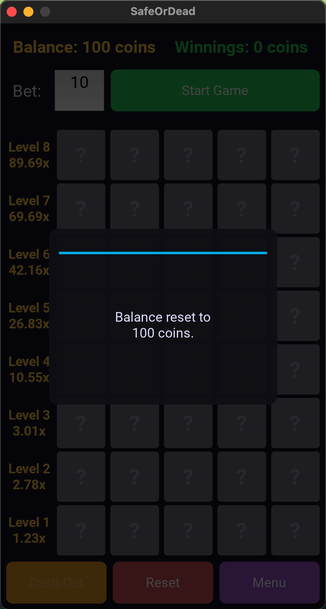

# SAFE or DEAD

## Project Description
A mobile-friendly Kivy game where you bet coins and climb 8 riskier levels by selecting a safe tile each round. Cash out any time—or hit a DEAD tile and lose the bet.

This project is a single-file Kivy application that implements a probability/pick game:
- You start with a coin **balance** (default 100).
- Enter a **bet** and press **Start Game**.
- Each of the **8 levels** presents **5 tiles**. Some tiles are **DEAD**, the rest are **SAFE**.
- Pick **one** tile per level:
  - **SAFE** → advance to the next level, winnings scale by a **multiplier**.
  - **DEAD** → the round ends and you lose the bet.
- You may **Cash Out** after any successful level to lock in winnings.

Core classes:
- `SafeOrDeadApp` (Kivy `App`) builds screen navigation and tracks global state (balance, sound).
- Screens: `IntroScreen`, `MainMenuScreen`, `InstructionsScreen`, `CreditsScreen`, `GameScreen` (the game logic lives here).
- UI helpers: `RoundedButton`, `CustomPopup`, and `GameTile` (visual state: `hidden`, `safe`, `dead`).

## Table of Contents
- [Installation](#installation)
- [Usage](#usage)
- [Features](#features)
- [Methodology](#methodology)
- [Examples](#examples)
- [References](#references)
- [Dependencies](#dependencies)
- [Algorithms / Mathematical Concepts Used](#algorithmsmathematical-concepts-used)
- [License](#license)
- [Acknowledgments](#acknowledgments)
- [Note](#note)

---

## Installation
> **Note:** Kivy has platform-specific prerequisites (e.g., SDL2). Use the official Kivy install docs if you hit build/runtime issues. Commands below are placeholders—adjust per OS and Python version.

1. **Install dependencies**
   ```bash
   pip install kivy
   ```

2. **Project files**
   - Ensure `main.py` is in the project root.
   - Place the sound file `button_click.wav` next to `main.py` (or update the path in code).

3. **(Optional) Packaging**
   - Desktop: look into `pyinstaller`.
   - Android: consider `buildozer`.

## Usage
Run the app:
```bash
python main.py
```

In the game screen:
1. Enter a **Bet** (integer, capped at 1000 and cannot exceed current balance).
2. Click **Start Game**.
3. Click **one tile** in the active level.
4. After a **SAFE** tile, either **Cash Out** or continue to the next level.
5. **RESET** returns to the idle state; **Reset Balance** sets balance back to 100.

## Features
- **8 levels**: Each with a fixed number of DEAD tiles: `[1, 1, 2, 2, 2, 3, 3, 4]`.
- **Multipliers Per level**: `[1.23, 2.78, 3.01, 10.55, 26.83, 42.16, 69.69, 89.69]`.
- **Cash Out**: At any time after level 1.
- **Sound effect**: On tile click (toggleable in main menu).
- **Resolution**: preset for a mobile-like portrait window.

## Methodology
High-level flow from start to finish:
1. **App setup**: `SafeOrDeadApp.build()` creates a `ScreenManager` and registers screens.
2. **Enter Bet → Start Game**:
   - Validate bet (integer > 0, ≤ balance, ≤ 1000).
   - Deduct bet from balance; set `level=1`, `current_winnings=0`, state=`ACTIVE`.
   - For **each level**, pre-generate **dead positions** by shuffling `[0..4]` and selecting `DEAD_COUNTS[level]`.
3. **Play a level**:
   - Enable only the current level’s 5 tiles; clicking one disables the row.
   - If tile ∈ `dead_positions` → reveal **DEAD**, show “Game Over” popup, reveal the whole board, transition to `GAME_OVER`.
   - Else → reveal **SAFE**, update `current_winnings = int(bet * MULTIPLIERS[level-1])`.
4. **Cash Out or Continue**:
   - **Cash Out**: Add `current_winnings` to balance, show game-over controls.
   - **Continue**: Increment `level`; if level > 8 → trigger **JACKPOT** and credit `bet * MULTIPLIERS[7]`.
5. **Reset / Restart**: Clears scheduled callbacks, resets tiles and visual state, re-enables inputs.

## Examples
- **Quick Example**:
  - Bet = **50** → SAFE at Level 1 to Level 3 → **Cash Out** at Level 3 → Restart Game → Credited `int(50 * 3.01) = 150`.
  - Net change vs Start of new round = `+150 - 50 = +100`.

### Sample of Application User Interface
| *Main Screen* |
|:--:| 
|  |

| *Credits Screen* |
|:--:| 
|  |

| *Instructions Screen* |
|:--:| 
|  |

| *Game Screen* |
|:--:| 
|  |

| *Game Over Popup Screen* |
|:--:| 
|  |

| *Tile Flipped Screen* |
|:--:| 
|  |

| *Cash Out Screen* |
|:--:| 
|  |

| *Balance Reset Screen* |
|:--:| 
|  |

## References
- The code uses simple Bernoulli trials and fixed multipliers.

## Dependencies
- **Python**: 3.8+
- **Kivy**
- **Standard libraries**: `random`, `enum`
- (Asset) `button_click.wav`

## Algorithms/Mathematical Concepts Used
At level *i*, there are 5 tiles with `dead_i` DEAD tiles. Picking one uniformly at random gives

$$p_i = \frac{5 - \text{dead}_i}{5}$$

Levels are independent, so the probability of reaching level *k* is

$$P(\text{reach } k) = \prod_{i=1}^{k} p_i$$

If you cash out at level *k*, the expected net return per unit bet is

$$EV_k = P(\text{reach } k) \cdot M_k - 1$$

where $$M_k$$ is the level-*k* multiplier (the bet is deducted upfront, winnings are $$M_k \cdot \text{bet}$$).

Given the code’s parameters:

| Level | Safe Tiles | Dead Tiles | p_i | P(reach level) | Multiplier | Expected Value (EV) (net per 1 bet) |
| --- | --- | --- | --- | --- | --- | --- |
| 1 | 4 | 1 | 0.80 | 0.800000 | 1.23 | -0.016 |
| 2 | 4 | 1 | 0.80 | 0.640000 | 2.78 | 0.779 |
| 3 | 3 | 2 | 0.60 | 0.384000 | 3.01 | 0.156 |
| 4 | 3 | 2 | 0.60 | 0.230400 | 10.55 | 1.431 |
| 5 | 3 | 2 | 0.60 | 0.138240 | 26.83 | 2.709 |
| 6 | 2 | 3 | 0.40 | 0.055296 | 42.16 | 1.331 |
| 7 | 2 | 3 | 0.40 | 0.022118 | 69.69 | 0.541 |
| 8 | 1 | 4 | 0.20 | 0.004424 | 89.69 | -0.603 |

> With these values, cashing out around **level 5** maximizes EV; the final jackpot level is **negative EV**. Tweak the multiplier table if you want a particular house edge.

## License
This project is licensed under the MIT License. See the LICENSE file for details.

## Acknowledgments
- Kivy authors and community.
- WavSource.com

## Note
| AI was used to generate most of the docstrings and inline comments in the code. |
|:--:|
